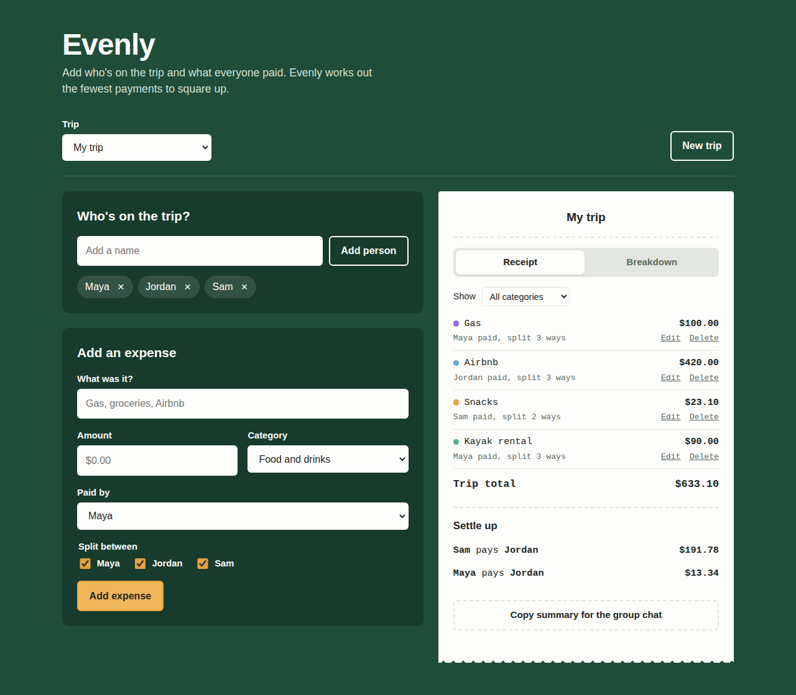

# Evenly: Trip Expense Splitter

A React app that splits shared trip costs and works out the fewest payments needed so everyone is even.



## Features
- Multiple trips: create, switch between and delete trips
- Add people and expenses, choose who paid and who shares each cost
- Expense categories (food, lodging, transport, activities, other)
- Edit or delete any expense
- Receipt tab: every expense, filter by category, and the settle-up plan
- Breakdown tab: spending by category bar and a per-person paid/share/balance table
- One-click copy of the settle-up summary for a group chat
- Money handled in cents to avoid rounding errors
- Saves automatically in the browser (localStorage)

## Built with
React 18, Vite, CSS

## Run it
```bash
npm install
npm run dev
```

Build for production:
```bash
npm run build
```
# math-tutoring
# evenly-expense-splitter
# evenly-expense-splitter
